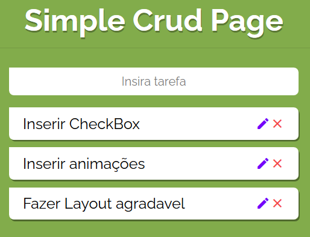

<h1 align="center">Simple Crud Laravel with DataBase</h1> 

## Tecnologias utilizadas

O projeto foi desenvolvido utilizando as tecnologias:

- Laravel
- HTML5 - CSS3
- Boostrap 4
- Jquery/Javascript

## Design

<table>
  <tr>
    <td colspan="2">Desktop</td>
 </tr>
  <tr>
    <td></td>    
  </tr>
</table>

## Executar esse projeto no seu computador

- Ter instalado o [Composer](https://getcomposer.org/Composer-Setup.exe)
- Clonar Repositório: `git clone https://github.com/juliopurschel/crudLaravel.git`

Ir até o local do arquivo através do terminal e executar:

- Instalar dependências: `composer install`
- Instalar dependências: `npm install` ou `yarn install`

- Gerar uma chave de criptografia do app: `php artisan key:generate`  
- Renomer o arquivo: `.env.example` para `.env`

:warning: Aqui você deve configurar seu **Banco de Dados** preenchendo corretamente o arquivo **`env`** com os dados do seu banco, *nesse deploy foi utilizado o postgre SQL* :warning:

- [x] Banco de dados configurado, voltamos ao terminal.
- Migrar tabelas: `php artisan migrate`.. *se houver a notificação de **"Nothing to migrate"** usar* `php artisan migrate:refresh`
- Iniciar o server: `php artisan serve`
- Server iniciado em: *seulocalhost:suaporta/todos*

Tudo Pronto parar usar a aplicação ! :+1:

Todos os arquivos incluídos aqui, incluindo este _README_, estão sob [Licença MIT](./LICENSE). 
Criado por [Julio Purschel](https://github.com/juliopurschel)
